# Dogmates
Dogmates: a dog social networking full-stack web application.

## How to Set up
> node version: v16.14.0
> 
> npm version: v8.3.1
> 

```shell
cd api
npm install
mongo dogmates scripts/init.mongo.js
npm start

cd ui
npm install
npm start
```

After setting up successfully, the front end will run at localhost:8000, the backend will run at localhost:3000.

## Demo
#### Homepage
The homepage of Dogmates includes the navigation bar, login/register entry, and the introduction and nav link of neighborhood and posting space.

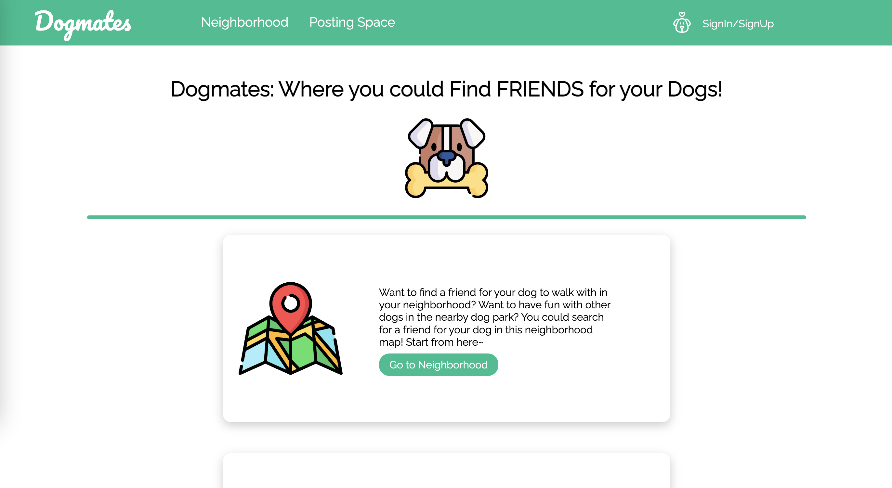
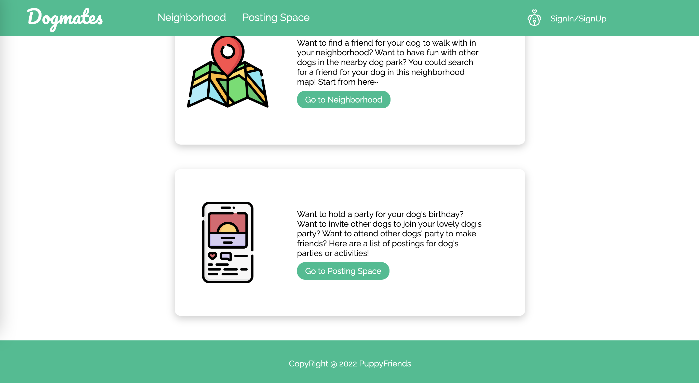

#### Login/Register
User could click the "SignIn/SignUp" Icon in the navigation bar of homepage to enter the login and register page.

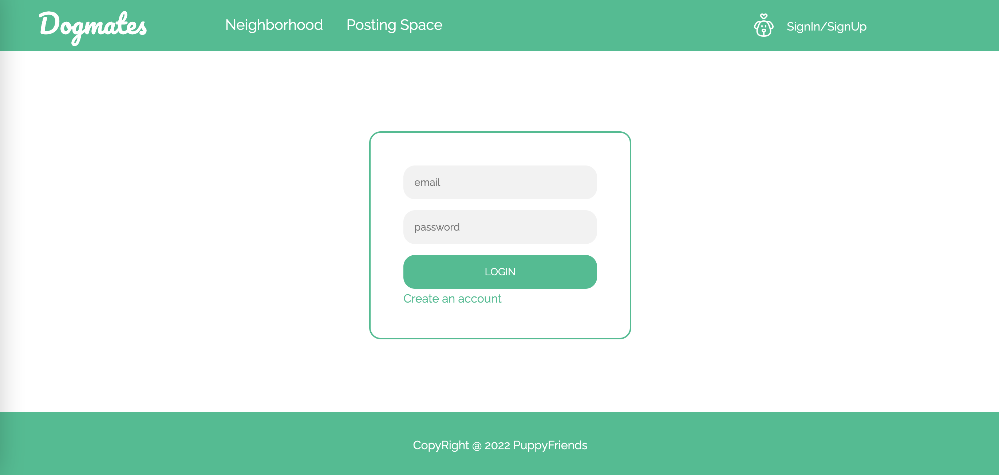
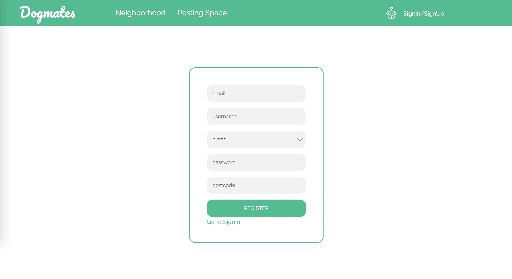

#### Neighborhood
After user login, the neighbood will display other users nearby and marked them on the map. **(Google Map + Google GeoLocation)**

Users could find others here and add them to their contact list.

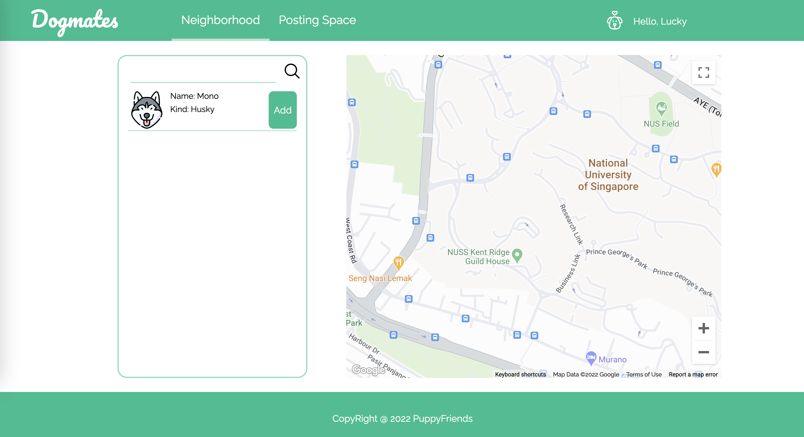

#### Posting Space
The posting space will display the posts posted by other users.
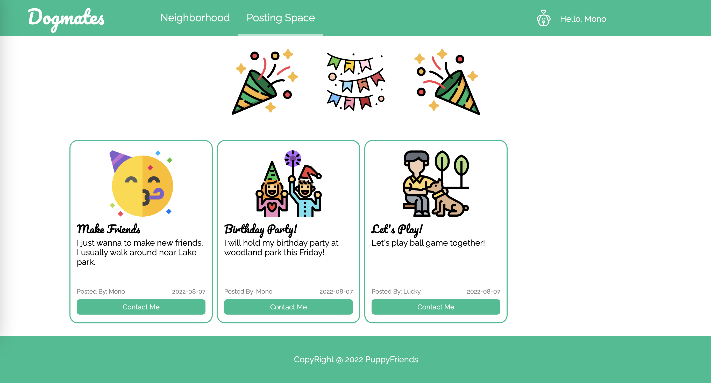

#### Dogal Space
Dogal Space is similar to Personal Space. Dogal Space page is divided into 4 subpages: Profile, My Posting list, Publish a Posting, and My Chatting.

- Profile displays the basic information of the user.
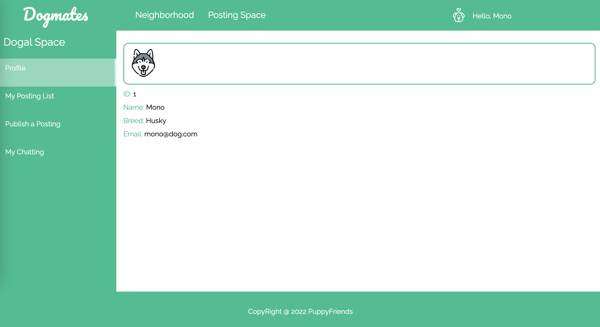
- My Posting List displays all the posts posted by the current user.
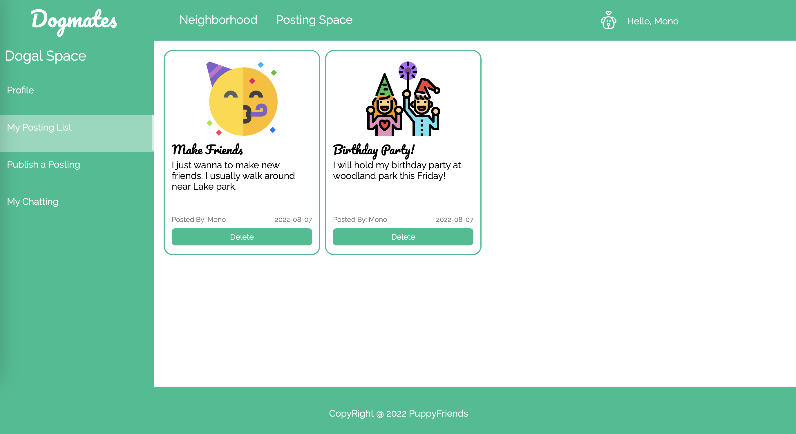
- Publish a Posting is for users to post a new posting. New Posted posting will be displayed in the Posting Space.
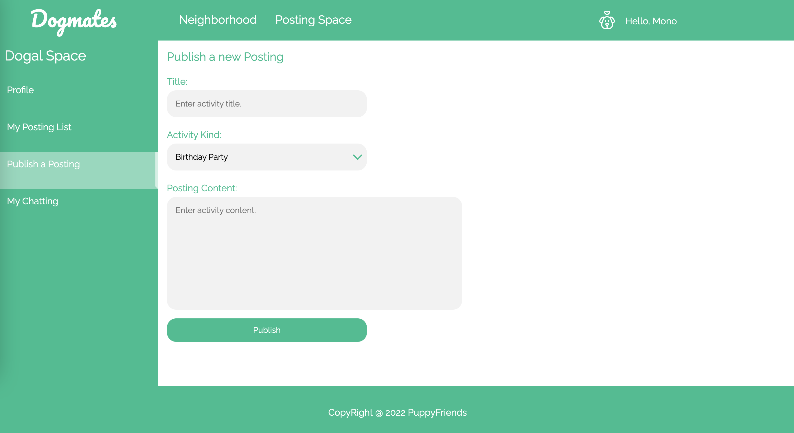
- Chatting is for users to get their contact list and chat with other users.
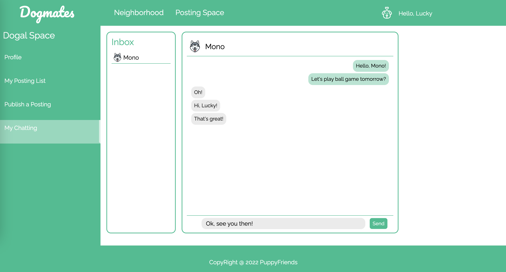
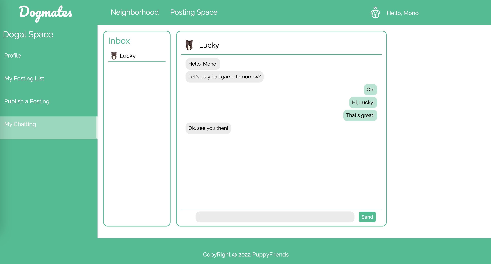